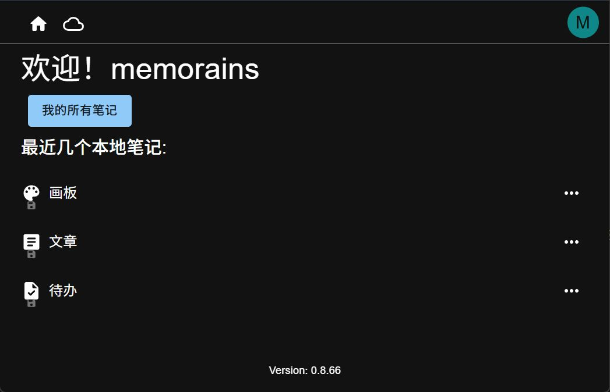
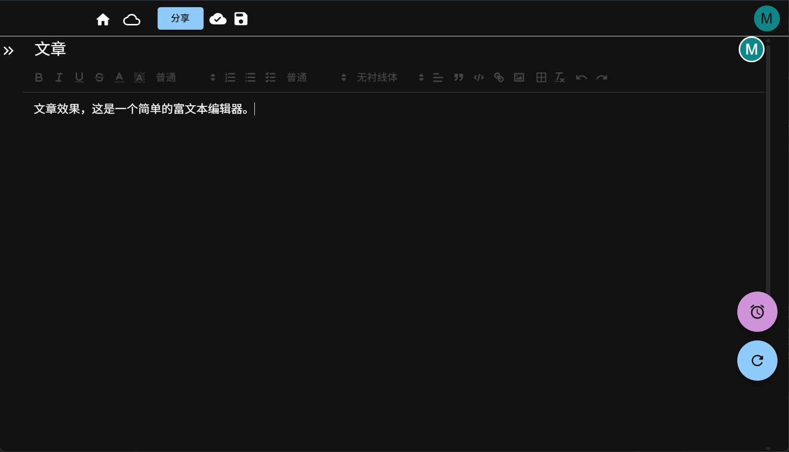
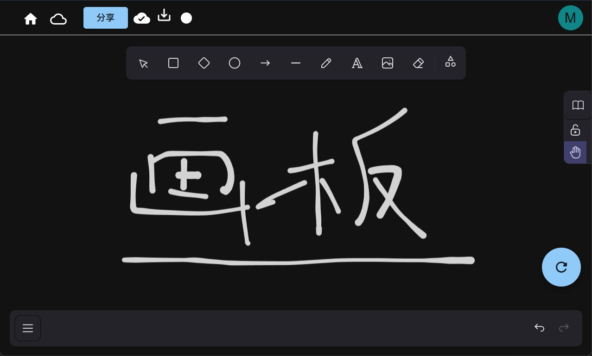
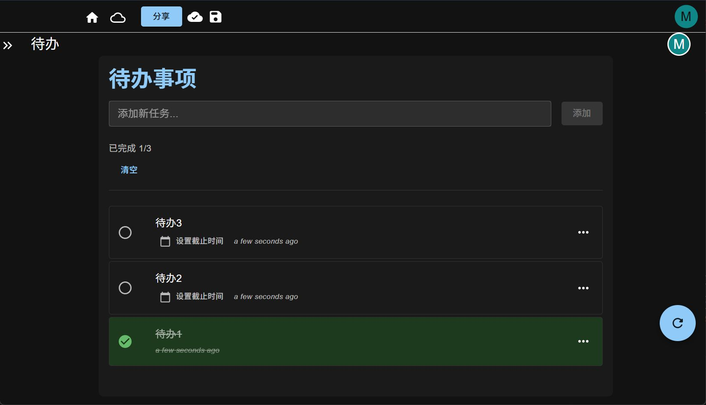

# Memorains

一个基于网页技术构建的笔记应用程序，集成了丰富的文本编辑画布绘图。它支持在线和离线使用，以及多用户和多设备协作，极大地提升内容的创建和协作效率。

- 原项目地址
  - 作者视频 https://www.bilibili.com/video/BV1sz42z4EJL
  - 官网 https://note.lirunlong.com/doc/client/
  - GitHub仓库 https://github.com/redTreeOnWall/memorains
- 我的仓库
  - GitHub仓库 https://github.com/Firfr/memorains
  - Gitee仓库 https://gitee.com/firfe/memorains
  - DockerHub https://hub.docker.com/r/firfe/memorains

## 汉化&修改&镜像制作

如果镜像拉取失败，请B站发私信，或提issues，  
华为云上的镜像仓库默认推送的镜像不是公开的，有可能是我忘记设置公开了。

当前制作镜像版本(或截止更新日期)：0.8.66

首先感谢原作者的开源。  
原项目没有docker镜像，我修改和制作了docker镜像。

修改说明
- 完善部分中文
- 优化镜像制作流程，制作镜像
  - 优化部署流程，从原作者给出的3个容器改成2个容器
  - 前后端代码打包在镜像中，减少文件挂载
    - 目前只需要准备一个数据库配置文件。
  - 优化 nginx 配置文件，修复之前配置非默认 80、443 端口情况下重定向错误
  - 优化数据库的配置，原来服务端关于数据库的配置是写死的，现在改成从环境变量中获取
  - 容器中添加自签证书，可替换成自己的
    - 证书 /app/certificate/cert.pem
    - 私钥 /app/certificate/cert.key

只做了汉化和简单修改，有问题，请到原作者仓库处反馈。

欢迎关注我B站账号 [秦曱凧](https://space.bilibili.com/17547201) (读作 qín yuē zhēng)  

有需要帮忙部署这个项目的朋友,一杯奶茶,即可程远程帮你部署，需要可联系。  
微信号 `E-0_0-`  
闲鱼搜索用户 `明月人间`  
或者邮箱 `firfe163@163.com`  
如果这个项目有帮到你。欢迎start。也厚颜期待您的打赏。

如有其他问题，请提`issues`，或发送B站私信。

## 镜像

从阿里云或华为云镜像仓库拉取镜像，注意填写镜像标签，镜像仓库中没有`latest`标签

容器内部端口`80` (没有证书)、`443`(自签证书)。

- 国内仓库
  - AMD64镜像
    ```bash
    swr.cn-north-4.myhuaweicloud.com/firfe/memorains:0.8.66
    ```
  - ARM64镜像
    ```bash
    swr.cn-north-4.myhuaweicloud.com/firfe/memorains:0.8.66-arm64
    ```
- DockerHub仓库
  - AMD64镜像
    ```bash
    firfe/memorains:0.8.66
    ```
  - ARM64镜像
    ```bash
    firfe/memorains:0.8.66-arm64
    ```

## 部署前准备

设置一个数据库的配置文件。

- 创建一个数据库配置文件目录
- 在这个目录中创建一个数据库配置文件，名字 `custom.cnf`
- 文件内容
  ```ini
  [mysqld]
  max_allowed_packet = 512M
  
  [client]
  max_allowed_packet = 512M
  
  ```

## 部署

```yaml
name: memorains

services:
  memorains_mariadb:
    container_name: memorains_mariadb
    image: docker.code.firfe.work/mariadb:11.8.6-noble
    environment:
      MYSQL_ROOT_PASSWORD: 123456
      MYSQL_DATABASE: document
      MYSQL_USER: doc
      MYSQL_PASSWORD: 123456
    #ports:
    #  - 3306:3306
    volumes:
      - 数据库配置目录:/etc/mysql/conf.d
      - 数据库存储目录:/var/lib/mysql

  memorains:
    container_name: memorains
    image: firfe/memorains:0.8.66
    stdin_open: true
    tty: true
    environment:
      - NODE_ENV=production
      - DB_HOST=memorains_mariadb
      - DB_PORT=3306
      - DB_USER=doc
      - DB_PASSWORD=123456
      - DB_NAME=document
    ports:
      - 5185:80
      - 5186:443
    depends_on:
      - memorains_mariadb

networks:
  default:
    name: memorains
    driver: bridge

```

## 环境变量说明

### 容器 mariadb

这个是 mariadb 数据库的官方镜像。

- MYSQL_ROOT_PASSWORD: 数据库 root 账号密码
- MYSQL_DATABASE: 初始化数据库的名字
- MYSQL_USER: 数据库用户名
- MYSQL_PASSWORD: 数据库密码

### 容器 memorains

这个就是我打包的这个项目的镜像。

- DB_HOST 数据库的IP或域名
- DB_PORT 数据库的端口
- DB_USER 数据库用户名
- DB_PASSWORD 数据库密码
- DB_NAME 数据库名字

## 效果截图

|  |  |
|-|-|
|  |  |
